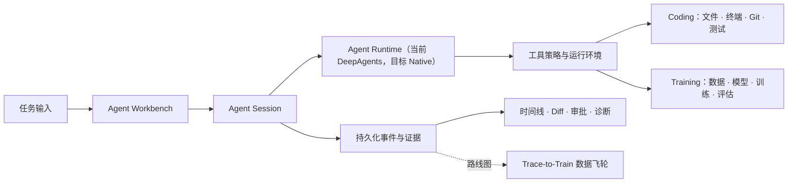

# Finetune Platform

[English](README_EN.md) | 简体中文

**本地优先的个人 AI Engineer：在同一个桌面工作台里编写软件，也训练模型。**


[](LICENSE)

Finetune Platform 正在从“大模型微调平台”演进为一个面向独立开发者的个人 AI Engineer App。你可以像使用 Coding Agent 一样输入任务，让它理解代码、修改项目、运行验证和展示证据；也可以让同一个 Agent 检查数据与硬件、提出训练方案、启动微调、追踪进度并评估模型。

代码、模型、数据集、会话、执行轨迹和训练产物默认保留在自己的电脑上。SQLite、本地文件和本地 GPU 是第一公民；PostgreSQL、Redis 和远程 Worker 只属于未来可选的团队版，不是个人版的运行前提。

> **当前阶段：活跃开发 / 源码预览。** Electron 已成为正式桌面运行时边界，并具备本地服务监督和受管 Python Runtime 基础。项目正在从 DeepAgents 迁移到自有 Native Agent Loop；迁移期间 Agent Workbench 只开放 Build，Train/Hybrid Agent 暂时禁用，独立训练页面、API 和 Training Worker 不受影响。真实发行用 Runtime Pack、签名安装器、自动更新和干净机器验收仍在路线图中。

## 产品承诺

> 在自己的电脑、自己的项目和自己的模型上，让一个 Agent 同时完成软件工程与模型工程任务；每次操作都可理解、可审批、可恢复、可评测。

这不是把训练后台和聊天窗口简单放在一起。产品围绕一个统一工作流组织：



目标任务模式包括：

- **Build：** 阅读仓库、实现功能、修复缺陷、运行测试并交付 Diff。
- **Train（迁移期禁用）：** 检查数据和显存、提出配置、经审批启动训练并跟踪结果。
- **Hybrid（迁移期禁用）：** 修改训练代码、验证预处理、启动小规模训练并比较评测。

## 为什么它不只是另一个 Coding Agent

| 普通 Coding Agent | Finetune Platform 的方向 |
|---|---|
| 修改代码并运行命令 | 同样具备 Coding 闭环，并把训练、评测和本地推理作为受控工具 |
| 依赖云端模型或远程沙箱 | 模型无关，本地模型、本地 GPU 和本地数据是正式路径 |
| 会话结束即交付 | 持久化计划、事件、Diff、审批、验证与工件，可刷新和恢复 |
| 只消费模型能力 | 目标是让高质量 Agent 轨迹经过评测和治理后反哺本地模型训练 |

核心差异不是堆叠更多页面，而是形成这条闭环：

```text
Coding / Training Task
        → 结构化执行轨迹
        → 自动评测与用户反馈
        → 版本化候选数据集
        → LoRA / QLoRA
        → 固定 Agent Eval
        → 本地模型重新部署
```

其中 Trace-to-Train 仍是后续阶段，不是当前已发布能力。

## 当前已经具备什么

### Coding Agent 工作台

- `/agent` 是默认产品入口，提供任务输入、对话、计划、时间线和上下文面板。
- Workspace 是长期工作边界；当前新建 Agent Session 统一使用 Build 模式。
- `AgentSessionService` 是唯一 Agent 生命周期所有者；迁移期间 DeepAgents 暂时承载生产 Build Loop，Native Loop 达到门禁后将替代它。
- 支持执行计划、文件操作、终端活动、持久化 Diff、验证证据和任务恢复。
- 支持 HITL interrupt/resume，敏感动作可以等待用户审批后在后台继续。
- 内置 Build、Explore、Review Agent manifest，并支持异步子 Agent 与状态投影。
- Agent Eval v1 提供版本化场景、确定性回归和显式 opt-in 的真实模型评测入口。

### 模型训练助手

- 管理本地模型、数据集、训练记录、评估与部署工件。
- 支持 LoRA/QLoRA、低显存配置、训练队列、独立 Training Worker 和检查点恢复。
- 既有 Agent 训练提案、审批和 Workbench 投影在 Native 迁移期间暂停开放。
- 独立训练页面、API、队列与 Worker 继续可用；Agent Train/Hybrid 会在 Native 契约稳定后重新接入。
- 推理服务独立运行，支持本地后端与 OpenAI-compatible 接口边界。

### 本地知识与桌面运行时

- RAG 知识库、项目上下文、代码符号索引、记忆和常见文档解析。
- Electron 负责本地 API、Training Worker 和 Inference Service 的启动、健康、重启与退出顺序。
- Renderer 通过版本化窄 IPC 获取状态，不持有内部服务密钥或任意宿主路径能力。
- 受管 Python 3.11 Runtime 支持严格 manifest、SHA-256、staging、健康探针、原子激活与修复基础。
- 用户数据库、模型、输出、日志、Workspace 和密钥与应用安装资源分离。

## 能力成熟度

运行时权威来自后端 `GET /api/info`；README 只做产品级摘要。

| 分层 | 能力 | 含义 |
|---|---|---|
| GA | device、models、datasets、training、inference、chat_sessions、knowledge_base | 主流程能力，需要兼容性和回归保障 |
| Beta | project_context、memory、model_center、workspace、agent_eval、cloud_chat | 已接入产品，但协议或交互仍可能演进 |
| Experimental | cua、heartbeat、mcp、gateway、ocr_fallbacks、action_recorder | 默认隔离的探索能力，不代表稳定产品承诺 |

仍在路线图中的关键能力包括可信沙箱、任务级 Git Worktree、修改账本与安全回退、复杂项目上下文、Trace-to-Train、受权限约束的扩展系统和正式桌面发行链路。

## 架构原则

- **单 Session 单 Loop：** 迁移期间同一 Session 只能选择 DeepAgents 或 Native Runtime，禁止嵌套双循环；最终由 Native Agent Loop 完全替代 DeepAgents。
- **强 Session、薄宿主：** 平台负责跨 Turn 生命周期、Workspace 绑定、持久化、审批、恢复、事件与诊断。
- **确定性 Workflow：** 应用状态机协调任务、训练、工件和幂等，但不与模型争夺“下一步工具”决策。
- **事件驱动扩展：** UI、评测、诊断、自动化和未来 Trace Collector 消费同一版本化事件事实。
- **本地安全优先：** 文件、命令、网络、密钥和 GPU 权限必须绑定明确的 Workspace、Session 与 Runtime。
- **团队版可替换：** 业务语义不直接依赖 SQLite、Redis 或 PostgreSQL；未来通过适配器迁移。

完整决策见：

- [Native Agent Loop 设计](docs/plans/2026-07-17-native-agent-loop-design.md)
- [Native Agent Loop 迁移计划](docs/plans/2026-07-17-native-agent-loop-migration.md)
- [ADR-0001：Agent Session 是唯一 Agent Runtime](docs/adr/0001-agent-session-as-primary-agent-runtime.md)
- [ADR-0012：采用 Native Agent Loop 并退出 DeepAgents](docs/adr/0012-adopt-native-agent-loop-and-retire-deepagents.md)

## 快速开始

### 环境要求

- Windows 10/11（当前桌面发行主目标；Linux/macOS 仍以开发环境为主）
- Python `>=3.11,<3.12`
- Node.js 18+
- Git
- NVIDIA GPU + CUDA：训练和本地 GPU 推理时推荐；控制面与部分测试可以 CPU 运行
- `uv`：推荐的 Python 依赖管理器

### Windows 源码快速启动

在仓库根目录执行：

```bat
start.bat
```

该路径启动本地开发栈。先检查环境可运行：

```bat
verify.bat
```

### 完整手动开发环境

```powershell
git clone https://github.com/lin09389/finetune-platform.git
Set-Location finetune-platform

uv sync --frozen --extra all --extra dev
npm install
Set-Location client
npm install
npm run build
Set-Location ..
```

启动 Electron 开发运行时：

```powershell
npm run start
```

开发模式要求可用的 Python 3.11 环境与对应依赖。可通过 `FINETUNE_PYTHON` 指定解释器，或通过 `FINETUNE_RUNTIME_MANIFEST` / `FINETUNE_RUNTIME_PACK_DIR` 测试本地 Runtime Pack。

### 分进程调试

```powershell
uv run --extra all python -m server.inference_server
uv run --extra all python -m server.training_worker
uv run --extra all python -m uvicorn server.main:app --host 127.0.0.1 --port 8010
```

另开终端启动 Renderer：

```powershell
Set-Location client
npm run dev
```

前端开发服务器使用 `127.0.0.1:5173`，默认直连 `127.0.0.1:8010`，不依赖 Vite proxy。

### Docker（可选）

```bash
docker compose up -d api
docker compose --profile dev up -d
docker compose --profile ollama up -d
```

个人桌面版不要求 Docker。依赖 profile 与镜像说明见 [docs/dependency-profiles.md](docs/dependency-profiles.md)。

## 常用验证命令

```powershell
# 后端
python -m pytest server/tests -m "not integration and not e2e" -q

# 前端
Set-Location client
npm run typecheck
npm run build
npm run test:smoke

# Electron / Runtime Pack
Set-Location ..
npm run test:desktop
npm run test:runtime-pack
npm run test:package-policy
```

`npm test` 是 Vitest watch 模式；一次性验证请使用 `npx vitest run` 或专项脚本。

## 项目结构

```text
finetune-platform/
├── electron/                 # 正式桌面宿主、服务监督、安全 IPC、受管 Python
├── client/src/agent/         # 默认 Agent Workbench
├── server/
│   ├── agent_session/        # 唯一 Agent 生命周期与 DeepAgents 适配
│   ├── agent_eval/           # 版本化 Agent 能力评测
│   ├── training_worker/      # 持久化训练队列与 GPU Worker
│   ├── training_engine/      # LoRA/QLoRA 训练管线
│   ├── inference_server/     # 独立本地推理服务
│   ├── apps/                 # combined / agent / finetune 应用装配
│   ├── workspace/            # Workspace 领域能力
│   ├── context/              # 项目上下文与索引
│   ├── rag/                  # 知识库
│   └── memory/               # 记忆系统
├── docs/                     # ADR、设计、运行与验收文档
├── scripts/desktop/          # Runtime Pack 与安装包策略工具
├── pyproject.toml            # Python 依赖事实源
└── uv.lock                   # 唯一 Python lockfile
```

`models/`、`datasets/`、`outputs/`、`workspaces/`、`logs/` 等是运行时数据，不是源码架构的一部分，也不应被打入桌面安装资源。

## 路线图

| 波次 | 目标 |
|---|---|
| Wave 0 | Build-only 迁移门禁、Native v2 命令/事件契约和非破坏性持久化基线 |
| Wave 1 | Native Session Host、双向 WebSocket、FIFO Follow-up Queue 与安全边界 Steering |
| Wave 2 | Native Sampling Loop、模型适配、Tool Runtime、审批策略与 Execution Environment 接口 |
| Wave 3 | 追加事件日志、周期快照、Goal 工作流、Compaction、修改账本与安全 Rewind |
| Wave 4 | 重写 Workbench v2，并完成真实 Build 项目和故障恢复验收 |
| Wave 5 | Native 默认切换、受控清理旧会话与 DeepAgents checkpoint，最终移除 DeepAgents |
| Wave 6 | 在 Native 契约上恢复 Train/Hybrid，并接入人工筛选的 Trace-to-Train |

Wave 5 是 Native Coding Agent 迁移完成点；Wave 6 恢复 Coding 与训练助手的一体化闭环。团队版仍不是个人版完成条件。

## 当前限制

- 真实 Python 3.11 基础 Runtime Pack 和签名 Windows 安装器尚未完成正式发布验收。
- 当前安全执行仍需继续演进为可验证、fail-closed 的 Execution Environment Provider。
- Agent Workbench 在 Native 迁移期间仅开放 Build；Train/Hybrid Agent 暂时禁用。
- 并行 Coding 任务尚未默认拥有独立 Git Worktree，合并与回退体验仍在路线图中。
- Trace-to-Train、公开扩展生态和团队版适配器尚未完成。
- CUA、MCP、Gateway、Heartbeat 等仍是 Experimental，不应视为稳定默认能力。

## 文档入口

- [能力成熟度与依赖](docs/capability-truth-table.md)
- [Coding Agent 工程闭环](docs/coding-agent-engineering-loop.md)
- [Agent Training Foundation](docs/agent-training-foundation.md)
- [Workspace 可移植性 ADR](docs/adr/0009-use-versioned-reference-manifests-for-workspace-portability.md)
- [桌面打包与数据边界](docs/desktop-packaging.md)
- [Phase 10 执行记录](docs/phase10-execution-2026-07-16.md)

## 许可证与致谢

本项目采用 [MIT License](LICENSE)。它建立在 FastAPI、React、Electron、PyTorch、Transformers、PEFT、DeepAgents、LangGraph、ChromaDB、Ollama 与更广泛的开源 AI 生态之上。
