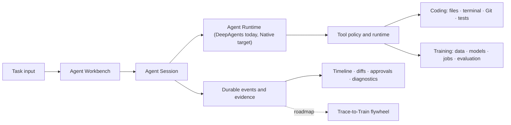

# Finetune Platform

English | [简体中文](README.md)

**A local-first personal AI Engineer that builds software and trains models from one desktop workbench.**


[](LICENSE)

Finetune Platform is evolving from an LLM fine-tuning console into a personal AI Engineer application for independent developers. You can give it a coding task and let it understand a repository, edit files, run verification, and present evidence. The same Agent can inspect data and hardware, propose a training plan, launch an approved fine-tuning job, follow its progress, and evaluate the resulting model.

Code, models, datasets, sessions, execution traces, and training artifacts stay on your machine by default. SQLite, local files, and local GPUs are first-class. PostgreSQL, Redis, and remote workers belong to a future optional team edition, not the personal runtime.

> **Current stage: active development / source preview.** Electron is the formal desktop runtime boundary and the managed Python foundation is implemented. The project is migrating from DeepAgents to a self-owned Native Agent Loop. During migration, Agent Workbench is Build-only; Train/Hybrid Agent modes are temporarily disabled, while the standalone training UI, APIs, and Training Worker remain available. Production runtime packs, a signed installer, automatic updates, and clean-machine acceptance are still roadmap work.

## Product Promise

> On your own computer, projects, and models, one Agent can perform both software and model engineering while every action remains understandable, approvable, recoverable, and measurable.



The target task modes are:

- **Build:** understand a repository, implement or repair code, run tests, and deliver a diff.
- **Train (disabled during migration):** inspect data and VRAM, propose a configuration, launch an approved job, and track results.
- **Hybrid (disabled during migration):** change training code, verify preprocessing, run a small experiment, and compare evaluations.

## Why It Is More Than Another Coding Agent

| Typical Coding Agent | Finetune Platform direction |
|---|---|
| Edits code and runs commands | Adds controlled dataset, training, evaluation, and local inference tools to the coding loop |
| Often assumes cloud models or remote sandboxes | Treats local models, GPUs, and user-owned data as formal product paths |
| Delivers when a chat ends | Persists plans, events, diffs, approvals, verification, and artifacts across refresh and restart |
| Only consumes model capability | Aims to turn reviewed Agent trajectories into governed local fine-tuning data |

The long-term loop is:

```text
Coding / Training Task
        → structured execution trajectory
        → evaluation and user feedback
        → versioned candidate dataset
        → LoRA / QLoRA
        → fixed Agent evaluation
        → local model deployment
```

Trace-to-Train is roadmap work, not a currently released feature.

## What Exists Today

### Coding Agent Workbench

- `/agent` is the default entry, combining task input, conversation, plan, timeline, and context.
- Workspace is the long-lived boundary; newly created Agent sessions currently use Build mode.
- `AgentSessionService` remains the only Agent lifecycle owner. DeepAgents temporarily runs production Build sessions until the Native Loop passes its cutover gates.
- Execution plans, file operations, terminal activity, durable diffs, verification evidence, and recovery are integrated.
- HITL interrupt/resume allows sensitive work to wait for approval and continue in the background.
- Built-in Build, Explore, and Review manifests support async subagents and durable status projections.
- Agent Eval v1 provides versioned scenarios, deterministic regression, and an explicit opt-in real-model path.

### Model Training Assistant

- Local model, dataset, training, evaluation, and deployment-artifact management.
- LoRA/QLoRA, low-VRAM profiles, a durable queue, an isolated Training Worker, and checkpoint recovery.
- Existing Agent training proposals, approval flows, and Workbench projections are paused during the Native migration.
- The standalone training UI, APIs, queue, and Worker remain available; Agent Train/Hybrid will return on the Native contracts.
- An isolated inference service supports local backends behind an OpenAI-compatible boundary.

### Local Knowledge and Desktop Runtime

- RAG knowledge base, project context, code-symbol indexing, memory, and common document parsing.
- Electron supervises the local API, Training Worker, and Inference Service lifecycle.
- The renderer consumes versioned narrow IPC and receives neither internal service secrets nor arbitrary host paths.
- Managed Python 3.11 foundations include strict manifests, SHA-256, staging, health probes, atomic activation, and repair.
- User databases, models, outputs, logs, workspaces, and secrets are separated from replaceable application resources.

## Capability Maturity

The runtime source of truth is `GET /api/info`.

| Tier | Capabilities | Meaning |
|---|---|---|
| GA | device, models, datasets, training, inference, chat_sessions, knowledge_base | Compatibility and regression protected core flows |
| Beta | project_context, memory, model_center, workspace, agent_eval, cloud_chat | Product-integrated, but protocols or UX may evolve |
| Experimental | cua, heartbeat, mcp, gateway, ocr_fallbacks, action_recorder | Isolated exploration surfaces, not stable product promises |

Trusted sandboxing, task-scoped Git worktrees, mutation rewind, complex-project context, Trace-to-Train, permissioned extensions, and the production desktop release pipeline remain on the roadmap.

## Architecture Principles

- **One loop per session:** during migration, a session selects either the DeepAgents or Native runtime and never nests both. The Native Agent Loop will ultimately replace DeepAgents.
- **Strong session, thin host:** the platform owns cross-turn lifecycle, workspace binding, persistence, approvals, recovery, events, and diagnostics.
- **Deterministic workflow:** application state machines coordinate jobs, artifacts, and idempotency without deciding the next model tool call.
- **Event-driven projections:** UI, evaluation, diagnostics, automation, and the future Trace Collector consume versioned event facts.
- **Local safety:** file, process, network, secret, and GPU permissions bind to an explicit Workspace, Session, and Runtime.
- **Team-ready interfaces:** domain behavior does not directly depend on SQLite, Redis, or PostgreSQL implementations.

Architecture references:

- [Native Agent Loop design](docs/plans/2026-07-17-native-agent-loop-design.md)
- [Native Agent Loop migration plan](docs/plans/2026-07-17-native-agent-loop-migration.md)
- [ADR-0001: Agent Session is the primary Agent runtime](docs/adr/0001-agent-session-as-primary-agent-runtime.md)
- [ADR-0012: Adopt the Native Agent Loop and retire DeepAgents](docs/adr/0012-adopt-native-agent-loop-and-retire-deepagents.md)

## Quick Start

### Requirements

- Windows 10/11 for the current desktop release target; Linux and macOS remain development-oriented
- Python `>=3.11,<3.12`
- Node.js 18+
- Git
- NVIDIA GPU + CUDA recommended for training and local GPU inference
- `uv` as the recommended Python dependency manager

### Windows Source Start

From the repository root:

```bat
start.bat
```

Check the environment first with:

```bat
verify.bat
```

### Full Development Environment

```powershell
git clone https://github.com/lin09389/finetune-platform.git
Set-Location finetune-platform

uv sync --frozen --extra all --extra dev
npm install
Set-Location client
npm install
npm run build
Set-Location ..
```

Start Electron:

```powershell
npm run start
```

Development requires a compatible Python 3.11 environment and dependencies. Use `FINETUNE_PYTHON` to select an interpreter or `FINETUNE_RUNTIME_MANIFEST` / `FINETUNE_RUNTIME_PACK_DIR` to exercise a local runtime pack.

### Process-by-Process Debugging

```powershell
uv run --extra all python -m server.inference_server
uv run --extra all python -m server.training_worker
uv run --extra all python -m uvicorn server.main:app --host 127.0.0.1 --port 8010
```

In another terminal:

```powershell
Set-Location client
npm run dev
```

The renderer uses `127.0.0.1:5173` and talks directly to `127.0.0.1:8010` without a Vite proxy.

### Optional Docker Profiles

```bash
docker compose up -d api
docker compose --profile dev up -d
docker compose --profile ollama up -d
```

The personal desktop path does not require Docker. See [dependency profiles](docs/dependency-profiles.md).

## Common Verification

```powershell
# Backend
python -m pytest server/tests -m "not integration and not e2e" -q

# Frontend
Set-Location client
npm run typecheck
npm run build
npm run test:smoke

# Electron / runtime pack
Set-Location ..
npm run test:desktop
npm run test:runtime-pack
npm run test:package-policy
```

`npm test` is Vitest watch mode. Use `npx vitest run` or a targeted script for one-off checks.

## Repository Map

```text
finetune-platform/
├── electron/                 # Desktop host, supervision, secure IPC, managed Python
├── client/src/agent/         # Default Agent Workbench
├── server/
│   ├── agent_session/        # Single Agent lifecycle and DeepAgents adapter
│   ├── agent_eval/           # Versioned Agent capability evaluation
│   ├── training_worker/      # Durable queue and GPU worker
│   ├── training_engine/      # LoRA/QLoRA pipeline
│   ├── inference_server/     # Isolated local inference service
│   ├── apps/                 # combined / agent / finetune assembly
│   ├── workspace/            # Workspace domain
│   ├── context/              # Project context and indexing
│   ├── rag/                  # Knowledge base
│   └── memory/               # Memory system
├── docs/                     # ADRs, design, operations, and acceptance
├── scripts/desktop/          # Runtime-pack and package policy tools
├── pyproject.toml            # Python dependency source of truth
└── uv.lock                   # Single Python lockfile
```

`models/`, `datasets/`, `outputs/`, `workspaces/`, and `logs/` are runtime data. They are not source architecture and must not be bundled as replaceable application resources.

## Roadmap

| Wave | Outcome |
|---|---|
| 0 | Build-only migration gates, Native v2 command/event contracts, and a non-destructive persistence baseline |
| 1 | Native Session Host, bidirectional WebSocket, FIFO follow-up queue, and safe-boundary steering |
| 2 | Native sampling loop, model adapter, Tool Runtime, approval policy, and Execution Environment interface |
| 3 | Append-only events, periodic snapshots, goal workflow, compaction, mutation ledger, and safe rewind |
| 4 | Rewritten Workbench v2 plus real Build-project and recovery acceptance |
| 5 | Native default cutover, scoped legacy-session/checkpoint cleanup, and final DeepAgents removal |
| 6 | Restore Train/Hybrid on Native contracts and add manually curated Trace-to-Train |

Wave 5 completes the Native Coding Agent migration. Wave 6 restores the integrated Coding + training-assistant loop. The team edition remains optional.

## Current Limitations

- Production Python 3.11 base runtime packs and a signed Windows installer have not completed release acceptance.
- Execution isolation still needs an enforceable, fail-closed Execution Environment Provider.
- Agent Workbench is Build-only during the Native migration; Train/Hybrid Agent modes are temporarily disabled.
- Parallel Coding tasks do not yet receive isolated Git worktrees by default.
- Trace-to-Train, public extensions, and team-edition adapters are not complete.
- CUA, MCP, Gateway, and Heartbeat remain Experimental.

## Documentation

- [Capability maturity and dependencies](docs/capability-truth-table.md)
- [Coding Agent engineering loop](docs/coding-agent-engineering-loop.md)
- [Agent Training Foundation](docs/agent-training-foundation.md)
- [Workspace portability ADR](docs/adr/0009-use-versioned-reference-manifests-for-workspace-portability.md)
- [Desktop packaging and data boundaries](docs/desktop-packaging.md)
- [Phase 10 execution record](docs/phase10-execution-2026-07-16.md)

## License and Acknowledgements

Finetune Platform is available under the [MIT License](LICENSE). It builds on FastAPI, React, Electron, PyTorch, Transformers, PEFT, DeepAgents, LangGraph, ChromaDB, Ollama, and the broader open-source AI ecosystem.
