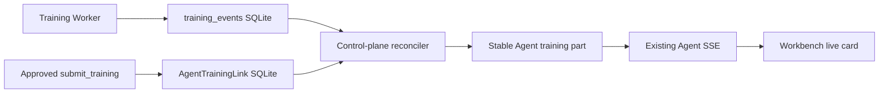

# Agent Training Live Sync Design

## Goal and constraints

Phase 6 makes an approved training task feel live inside the Agent Workbench. After submission, the same persisted card advances through queued, loading, running, terminal, and artifact-ready states without asking the model to call `get_training_summary` again. Refresh and API restart must reconstruct the same identity and latest authoritative state.

The product remains single-machine-first. SQLite training events and jobs are authoritative; the Agent database stores only ownership-bound links and safe projections. No Redis, PostgreSQL, WebSocket service, or second task queue is introduced. The bridge must be CPU-only, bounded, idempotent, stoppable during lifespan shutdown, and unable to reveal output/checkpoint paths or Worker identifiers.

## Approaches considered

1. **Recommended: control-plane reconciler.** Persist a session/task link, read training events by sequence through an interface, and update one Agent part idempotently. This respects domain ownership and has a clean future adapter seam.
2. **Worker dual-write.** Let the training worker update Agent parts. This has low latency but couples the GPU execution plane to Agent schema, authentication, and failure modes.
3. **Browser polling.** Let the Workbench call training progress endpoints. This is simple but loses offline progress, duplicates state logic in the client, and cannot reliably recover after refresh.

## Architecture and data flow

`agent_training` remains the proposal/submission authority. On successful approved submission, the control plane transactionally records an `AgentTrainingLink` containing `session_id`, `owner_id`, `proposal_id`, `task_id`, the stable timeline `part_id`, last consumed training event sequence, and projected status. A `TrainingEventSource` interface exposes task-scoped incremental events and current run summaries. Its local implementation reads the existing SQLite `TrainingJobRepository`; a future team adapter may read Redis/PostgreSQL without changing Agent contracts.

A single lifespan-managed reconciler wakes with bounded backoff, claims no GPU resources, reads only links that are non-terminal or need final reconciliation, and processes events in sequence order. Each update validates ownership, sanitizes the event through the existing training activity DTO, updates the stable Agent part, and publishes an ordinary Agent event so existing SSE delivers it. Advancing the cursor and projection is idempotent; replaying an event cannot create another card.

## Projection contract

The existing `run_summary` activity gains optional allowlisted fields: `phase`, `step`, `total_steps`, `epoch`, `loss`, `elapsed_time`, `eta`, `updated_at`, and `artifact_available`. No path, raw log, worker id, prompt, token, or arbitrary training payload is persisted. Unknown event kinds do not advance the visible card, but their sequence handling must not create an infinite replay loop. Terminal status is derived only from authoritative job/summary state.

The UI displays determinate progress only when `total_steps > 0`; otherwise it uses an indeterminate status. It preserves generic fallback for malformed projections. Completed tasks expose a safe “available in Models/Training” handoff, not a filesystem path.

## Failure and recovery

- API restart: persisted links retain the cursor; startup reconciliation catches up.
- Duplicate/replayed event: compare sequence and update the same part/link only once.
- Worker unavailable: keep the last authoritative state and mark the bridge degraded after bounded failures; never invent failure/completion.
- Missing job: retry for a bounded grace window, then persist a safe `missing` state requiring manual review.
- Session deleted or ownership mismatch: stop syncing and never attach the task to another session.
- SQLite busy: use existing retry/busy-timeout behavior and back off without blocking the event loop.

## Acceptance

A Train or Hybrid session submits once, obtains one task link and one stable card, receives ordered progress without model calls, survives refresh/restart, and ends in the same terminal status as the Worker record. Build sessions cannot create links. Cross-user task/session linking is rejected. Tests use SQLite and fakes only—no CUDA, downloads, live Worker, or network.

