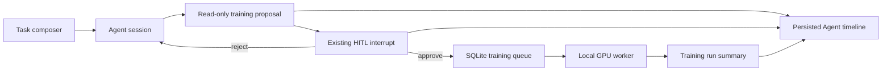

# Unified Agent Golden Path Design

## Requirements

The next product milestone turns the existing Agent training foundations into one visible, recoverable user journey inside the Codex-like Workbench. A user selects a Workspace and `build`, `train`, or `hybrid` mode, describes the goal once, reviews the generated training proposal, explicitly approves submission, and follows the authoritative run result without leaving the task conversation.

The default deployment remains a personal, single-machine product: SQLite is authoritative, GPU work stays behind the existing worker and lease boundaries, and no Redis or PostgreSQL service is required. Contracts must carry stable identifiers and serializable payloads so a later team deployment can replace storage and queue adapters without changing the Workbench protocol.

Non-functional targets for this milestone are: no duplicate submission after retry or refresh; no training start without approval; SSE refresh recovery from persisted parts; safe redaction of local paths and secrets; a useful disconnected/degraded state; and focused backend/frontend tests that run on a CPU-only development machine.

## Approaches Considered

1. **Recommended: one vertical golden path.** Extend the existing Agent part/event contract with a small training activity projection and render it in the existing timeline. This produces a usable product loop with the fewest new concepts.
2. **Dedicated training-agent application.** Build a separate route and orchestration service. This gives design freedom but fragments the unified Codex-like narrative and duplicates session lifecycle behavior.
3. **Generic tool JSON only.** Keep exposing raw tool results and improve labels. This is cheapest, but users cannot reliably understand proposal readiness, approval scope, run identity, or recovery state.

## Architecture

The existing `AgentSessionService` and DeepAgents runtime remain the only Agent execution path. `agent_training` remains the domain service for proposal validation, approval-bound submission, persistence, and summaries. The backend converts successful training tool activity into a stable, display-safe training activity projection stored in Agent parts/events. The frontend derives cards from that projection and never invents training state locally.

`build` exposes coding tools, `train` exposes training tools, and `hybrid` exposes both through the current manifest/runtime policy. Mode is immutable for a running session and is restored from session metadata after refresh. Approval continues through the existing DeepAgents interrupt wrapper; no second approval engine is introduced.

## Data and Failure Flow

Every activity projection carries `kind`, `proposal_id` or `task_id`, status, a safe summary, and the source tool name. Proposal configuration remains server-authoritative; the UI displays only allowlisted fields. Duplicate submit attempts return the previously claimed task. Unknown or malformed projections remain visible as generic tool activity instead of breaking the timeline.

If SSE disconnects, the client reloads persisted session parts and reconstructs the same cards. If the training worker is unavailable, submission/run status reports a degraded or queued state rather than marking the Agent session successful prematurely. Rejection, blocked proposals, stale proposals, ownership mismatches, and missing runs have distinct user-facing outcomes.

## Parallel Ownership

- Backend contract track owns `server/agent_training/`, training-event projection code under `server/agent_session/`, and matching backend unit tests.
- Frontend experience track owns `client/src/agent/` and matching Vitest files. It consumes the documented projection and retains a generic fallback.
- Acceptance track owns new end-to-end fixtures/tests and milestone documentation; it must not rewrite implementation files owned by the first two tracks.

## Acceptance

The milestone is complete when a fresh `train` session can produce a safe proposal, pause for approval, submit exactly once, expose a task identifier, restore the activity after refresh, and show a run summary. A `hybrid` session must retain normal coding activity alongside the same training cards. A `build` session must not receive training tools.

