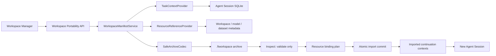

# Phase 8 — Workspace 可移植性与任务连续性设计

## 1. 目标与边界

Phase 8 把 Workspace 提升为个人 AI 工程项目的长期边界。用户可以从一台机器导出一个小型 `.ftworkspace` 包，在另一台机器导入、重新绑定源码与本地资源，并从新的 Agent Session 安全续接 Coding、Training 或 Hybrid 任务。

首版导出版本化 manifest、任务摘要、执行计划、变更文件元数据、验证结果、资源引用和包内校验和。它不打包项目源码、模型权重、checkpoint、数据集大文件、知识库原文、完整 Diff、完整终端日志、API key、令牌或其他密钥。

导入不会恢复正在运行的进程，不会恢复 DeepAgents checkpoint，不会自动执行命令、写项目文件、下载模型或提交训练任务。旧审批、`session_tool_trust` 和自治授权不会迁移。导入后的“继续任务”始终创建新会话，并重新经过当前机器的 Workspace、模型工具调用、shell、资源与审批策略检查。

## 2. 方案比较

| 方案 | 优点 | 主要问题 | 结论 |
| --- | --- | --- | --- |
| 打包源码与运行数据 | 恢复最完整 | 体积大、泄密面大、复制模型/数据、与 Git 冲突 | 拒绝 |
| 导出 SQLite/目录快照 | 实现直接 | 将内部表结构变成外部协议，难迁 PostgreSQL，难做最小披露 | 拒绝 |
| 版本化引用清单包 | 小、可审计、与存储实现解耦、适合单机与团队版 | 导入需要资源重新绑定 | 采用 |

## 3. 高层架构



后端新增 `server/workspace/portability/` 领域包。Pydantic schema 是外部契约；API 路由只处理鉴权、上传下载与错误映射；SQLite、Agent Session 和本地资源读取通过小型 Protocol 注入。首版仍使用 SQLite 和本地文件，但 manifest 不暴露数据库表、绝对路径或服务实现。

## 4. 包与 Manifest v1

`.ftworkspace` 是受限 ZIP 容器，仅允许以下条目：

```text
manifest.json
contexts/tasks.json
checksums.json
```

不允许任意文件名、嵌套压缩包、符号链接或可执行内容。建议 v1 限制：最多 32 个条目、单条 2 MiB、解压总量 10 MiB、压缩比不超过 100、任务上下文最多 100 条、资源引用最多 500 条。

核心 envelope：

```json
{
  "schema": "finetune.workspace-manifest",
  "schema_version": 1,
  "portable_workspace_id": "pws_...",
  "exported_at": "2026-07-13T00:00:00Z",
  "producer": {"name": "finetune-platform", "version": "2.1.0"},
  "workspace": {"name": "demo", "description": null},
  "project": {"display_name": "demo", "git_head": "...", "remote_hint": null},
  "resources": [],
  "task_contexts": [],
  "integrity": {"algorithm": "sha256", "checksums_entry": "checksums.json"}
}
```

`portable_workspace_id` 跨导出保持稳定；导入始终创建新的本机 `workspace_id`，避免覆盖现有 Workspace。绝对路径不进入包。Git remote 仅允许脱敏后的 host/path，必须去除 userinfo、查询参数和 fragment。

## 5. 任务连续性契约

每个任务上下文只保留安全续接所需字段：原任务 ID 的不可逆来源指纹、标题、`build/train/hybrid` 模式、终态、结构化执行计划、完成摘要、变更文件相对路径与 additions/deletions、验证命令类别与结果、工件/训练运行的安全引用、更新时间。

默认排除原始 prompt、assistant 全文、工具参数、工具原始输出、终端全文、Diff 正文、环境变量、绝对路径、审批 payload 和模型供应商凭据。摘要在导出前经过长度限制与 secret scanner；命中高置信凭据时导出 fail closed，并返回字段级报告。

导入后上下文存为只读历史索引，不直接插入可运行的旧 Agent Session。用户点击“继续此任务”时，系统创建新会话，继承 Workspace、任务模式、标题、计划摘要和显式安全上下文；自治模式使用当前本机默认，所有工具信任为空，所有资源重新解析。

## 6. 资源引用与重新绑定

资源引用采用类型化 DTO：

- `project`: basename、Git HEAD、脱敏 remote hint；必须绑定到通过 `workspace.path_policy` 的本地目录。
- `dataset`: 平台资源 ID、显示名、格式、大小、已有 checksum；不复制数据。
- `model`: logical/repository ID、revision、backend hint；不复制权重。
- `checkpoint`: task/model 关系、step、已有 metadata checksum；不复制目录。
- `artifact`: 类型、显示名、来源 task/run、checksum；不复制实际产物。
- `knowledge`: collection identity 与摘要统计；不复制原文或向量库。

导入检查结果为 `resolved`、`missing`、`mismatch`、`unsupported`。`missing` 不阻止创建 Workspace，但阻止依赖该资源的自动续接动作。重新绑定路径必须重新走所有权和允许根策略；模型/数据集绑定必须查询当前资源目录，不能信任包内 locator。

## 7. API 与两阶段导入

- `GET /workspace/workspaces/{id}/portability/preview`：显示将导出的内容、排除项和风险。
- `POST /workspace/workspaces/{id}/exports`：生成并下载 `.ftworkspace`。
- `POST /workspace/imports/inspect`：上传到临时区，只解析和校验，返回短期 import token、预览和资源状态；不改变 Workspace。
- `POST /workspace/imports/{token}/commit`：提交名称、项目目录和资源绑定，原子创建本机 Workspace 与只读续接上下文。
- `GET /workspace/workspaces/{id}/continuations`：列出导入的任务上下文。
- `POST /workspace/workspaces/{id}/continuations/{context_id}/sessions`：创建安全续接会话。

inspect token 绑定用户、文件摘要与过期时间。commit 幂等；重复请求返回同一导入结果。失败时不留下半创建 Workspace。临时包在提交或过期后清理。

## 8. 前端体验

Workspace Manager 保持现有视觉语言，新增：

- 顶部“导入 Workspace”主操作。
- Workspace 卡片菜单中的“导出”和“迁移检查”。
- 三步导入 Drawer：选择文件 → 检查与重新绑定 → 完成摘要。
- 明确展示“不会包含什么”、schema 版本、完整性状态、任务数量与资源缺失。
- 缺失资源使用分组状态和修复操作，不使用大段红色错误文本。
- 导入完成后提供“进入 Workspace”和“继续最近任务”，后者创建新会话。

移动端 Drawer 使用全屏布局；关键按钮保持至少 44px；加载、空、错误和成功状态复用 Phase 7.5 的共享状态组件。

## 9. 非功能要求

- 单机默认零新增服务依赖，继续使用 SQLite、本地文件和本地 GPU。
- 10 MiB 合法包的 inspect 在消费级电脑上目标 p95 小于 2 秒。
- 导出结果对相同逻辑输入保持确定性字段顺序；时间字段除外。
- 所有写入使用临时文件、`fsync` 和 `os.replace`；commit 失败可重试。
- 绝对路径、凭据、原始代码和高基数敏感值不进入日志或指标标签。
- schema v1 严格解析，未知顶层字段拒绝；未来版本通过显式 migrator 升级。
- 本地 adapter 和未来 PostgreSQL/Object Store adapter 共享契约测试。

## 10. 失败模式与缓解

| 失败 | 行为 |
| --- | --- |
| ZIP slip / symlink / archive bomb | inspect 拒绝，不写目标目录 |
| checksum 不一致 | 标记 tampered 并拒绝 commit |
| schema 过新 | 返回 unsupported_version，不做部分导入 |
| secret scanner 命中 | 导出 fail closed，报告安全字段路径 |
| 项目路径不存在或越界 | 保留预览，要求重新绑定 |
| 资源缺失 | Workspace 可导入，相关 continuation 标记 blocked |
| commit 中断 | 原子回滚；同 token 可安全重试 |
| 同 portable ID 重复导入 | 默认创建新本机实例并记录来源；不覆盖 |

## 11. 验收标准

1. 合法 Workspace 可以导出、inspect、重新绑定并导入。
2. 包中不含绝对路径、密钥、源码、完整 Diff、模型或数据集内容。
3. 导入能恢复 Build/Train/Hybrid 任务摘要、计划和安全资源引用。
4. 继续任务创建新 session；工具信任、审批和 runtime checkpoint 均为空。
5. 缺失资源有明确报告和修复入口，不破坏 Workspace 其他能力。
6. ZIP slip、压缩炸弹、篡改、版本不兼容、跨用户 token 均被拒绝。
7. 后端契约测试、前端 Vitest、类型检查、构建和桌面/移动视觉验收全部通过。
