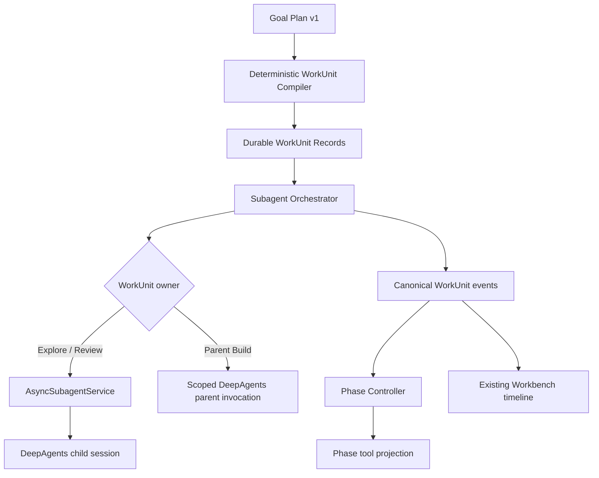
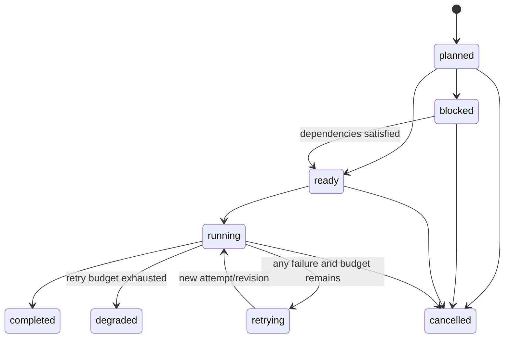

# Task 12 Typed Work Unit Orchestration Design

**Date:** 2026-07-29

**Status:** Approved for implementation planning

**Scope:** Controlled Build sessions only

## 1. Purpose

Task 12 replaces model-decided subagent creation in Controlled Build sessions
with a platform-owned, typed, durable WorkUnit orchestrator.

DeepAgents remains the only model/tool iteration loop. The platform decides
which deterministic unit is active, which role owns it, which tools are
visible, when dependencies are satisfied, and when a phase boundary has
actually completed. DeepAgents reasons and selects tools only inside the
currently supplied WorkUnit.

This design refines Task 12 in
`docs/plans/2026-07-18-controlled-tool-platform-integration.md` and implements
the work-unit portion of ADR-0012.

## 2. Confirmed decisions

The following decisions are fixed for Task 12:

1. The parent Build Agent is the only writer until task-level Git worktrees
   exist.
2. Explore and Review children are read-only and may run concurrently.
3. WorkUnits are compiled deterministically from the attached Goal Plan.
   Task 12 adds no planner or delegation model call.
4. Missing, invalid, or empty Goal Plans fall back to a parent-only Controlled
   Build. They do not block the prompt and do not enable typed phase binding.
5. Role assignment is owned by a fixed platform mapping, not by a model field.
6. Review is a structured delivery gate. `changes_required` returns execution
   to Implement within the bounded retry budget.
7. Read-only children never escalate a side-effect request to the user.
8. Every failure class retries up to the Goal Plan `max_phase_retries` budget.
   Retries never widen authority.
9. The parent DeepAgents runtime is invoked once per parent-owned WorkUnit so
   the phase catalog can be rebound between units.
10. Task 12 reuses the existing Workbench timeline and async-subtask surfaces.
    A dedicated WorkUnit DAG UI is deferred.

## 3. Architecture



The new components are:

- `work_unit.py`: strict WorkUnit and WorkUnitResult contracts, deterministic
  compiler, stable identity, role mapping, graph validation, and bounded
  resource defaults.
- `subagent_orchestrator.py`: dependency scheduling, attempts, retries,
  cancellation, recovery, Review gating, parent/child dispatch, and phase
  boundary production.
- scoped DeepAgents invocation support: a parent session can execute a
  bounded WorkUnit without finalizing the whole session.

Existing components retain their current responsibilities:

- `AsyncSubagentService` remains the child-session execution and persistence
  plumbing.
- `AgentSessionRepository` remains the SQLite fact source.
- `PhaseController` remains a deterministic phase state machine.
- `Tool Gateway` and DeepAgents interrupt/resume remain the enforcement and
  approval boundaries.

## 4. WorkUnit contract

The wire schema is `agent.work_unit.v1`. Models are strict
(`extra="forbid"`), immutable, JSON-only, and reject hidden reasoning fields.

Core fields:

| Field | Meaning |
|---|---|
| `work_unit_id` | Stable ID derived from parent session, plan fingerprint, and candidate ID |
| `parent_session_id` | Owning Build session |
| `plan_fingerprint` | Canonical Goal Plan content hash |
| `candidate_id` | Source Goal Plan candidate |
| `phase` | Canonical platform phase |
| `owner` | `parent_build`, `explore_child`, or `review_child` |
| `dependencies` | WorkUnit IDs that must reach an acceptable terminal state |
| `file_scope` | Normalized workspace-relative paths and read/write modes |
| `tool_projection` | Canonical, executable-free tool catalog snapshot |
| `budget` | Attempts, model calls, elapsed time, and concurrency class |
| `verification_requirements` | Required evidence for Verify/Review |
| `expected_artifacts` | Safe artifact kinds and logical references |
| `retry_policy` | Per-unit retry budget derived from Goal Plan |
| `cancellation` | Parent cancellation and stale-plan behavior |

`WorkUnitResult` contains:

- `verdict`: `pass`, `changes_required`, `completed`, or `degraded`;
- `summary`;
- structured `findings`;
- safe `evidence_refs`;
- safe `artifact_refs`;
- `recommended_next_phase`;
- attempt and child-session references.

It never stores chain-of-thought, credentials, unredacted command output, or
host absolute paths.

## 5. Deterministic compilation

The compiler consumes the already attached `agent.goal.plan.v1`. It does not
call a model.

Fixed role mapping:

| Canonical phase | Owner | Effective authority |
|---|---|---|
| Inspect | Explore child | Read-only |
| Plan | Explore child | Read-only |
| Implement | Parent Build | Controlled write |
| Verify | Parent Build | Controlled verification |
| Review | Review child | Read-only |
| Deliver | Parent Build | Controlled summary/delivery |
| Unknown/custom | Parent Build | Fail-safe parent ownership |

Phase normalization may use known canonical IDs and exact normalized titles.
An ambiguous phase is never delegated.

Child authority is a strict intersection:

```text
child authority
  = parent authority
  ∩ role read-only policy
  ∩ WorkUnit file scope
  ∩ current phase projection
  ∩ workspace policy
```

Goal Plan file scopes may only narrow the parent Workspace. They never grant a
tool, path, capability, model, or environment.

The compiler rejects:

- dependency cycles;
- missing candidate or phase references;
- more than 12 WorkUnits;
- duplicate stable IDs with different content;
- invalid or escaping paths;
- child write scopes;
- resource budgets above platform ceilings.

Compilation failure records safe diagnostics and returns the session to
parent-only Controlled Build without setting the typed boundary driver.

## 6. Persistence and idempotency

Task 12 reuses `agent_subtasks` and `agent_subtask_events`.

```text
agent_subtasks.id          = stable WorkUnit ID
agent_subtasks.input_json  = immutable WorkUnit envelope
agent_subtasks.result_json = current structured result and safe evidence
child_session_id           = current DeepAgents child revision, if any
agent_subtask_events       = append-only WorkUnit lifecycle facts
```

No second work-unit database is introduced.

Repository operations must provide:

- create-if-absent using an explicit stable ID;
- exact-envelope comparison on duplicate ID;
- transactional attempt/revision advancement;
- list-by-parent and list-by-plan-fingerprint;
- monotonic terminal-state updates;
- event-ID idempotency;
- stale child revision rejection.

The SQLite record, not an in-memory `asyncio.Task`, is authoritative.

## 7. State machine



Terminal states are monotonic. Late events are recorded but cannot revert a
terminal WorkUnit.

Every failure class consumes the same per-WorkUnit retry budget:

```text
total attempts = 1 + goal_plan.retry_policy.max_phase_retries
```

This includes provider failures, timeouts, invalid structured output,
authority violations, child crashes, and Review execution failures. Each retry
uses a new attempt and, for child-owned units, a new child-session revision.
The WorkUnit ID, authority, file scope, model binding, and tool projection do
not change.

After the budget is exhausted, the unit becomes `degraded`. The parent Build
Agent receives a safe diagnostic and performs the fallback work.

## 8. Scheduling and Review gate

- Explore and Plan children may run concurrently, with a hard maximum of two.
- Parent Implement, Verify, and Deliver units are serial.
- Review children start only after Verify passes.
- A dependency becomes runnable only after all required predecessors are
  completed or explicitly degraded with an allowed parent fallback.
- Steering is consumed only at a WorkUnit boundary.
- Parent cancellation cascades to all non-terminal units and child sessions.
- Child failure never directly corrupts or terminally fails the parent.

Review semantics:

- `pass` permits Deliver.
- `changes_required` transitions the parent phase back to Implement and
  consumes the existing phase retry budget.
- Review runtime failure retries as any other WorkUnit failure.
- After Review retry exhaustion, the parent performs a scoped fallback Review.
- Exhausting the Implement/Review correction budget moves the session to
  `needs_manual_review`.

## 9. Scoped DeepAgents invocation

The current `run_prompt()` treats one DeepAgents run as a whole session. Task
12 adds an internal WorkUnit execution scope:

```json
{
  "type": "work_unit",
  "work_unit_id": "wu_...",
  "attempt": 1,
  "phase": "implement",
  "finalize_session": false
}
```

Parent-owned WorkUnits:

1. re-read the durable WorkUnit and phase state;
2. rebuild the phase-specific `AgentRuntimeContract`;
3. invoke DeepAgents using the same parent session and checkpoint;
4. persist a structured WorkUnit result;
5. emit a phase boundary only after result validation;
6. rebuild the next phase contract.

Non-Deliver WorkUnits do not emit `summary_completed` and do not mark the
parent session completed. Deliver is the only scope that finalizes the session.

HITL remains inside DeepAgents. An interrupt is bound to the current WorkUnit
ID and attempt. Approval resume continues that same attempt before the
orchestrator may advance.

This is deterministic workflow around DeepAgents, not a second model/tool loop.

## 10. Controlled and legacy behavior

Task 12 applies only when all are true:

- `agent_id == "build"`;
- task mode is Build;
- orchestration mode is Controlled;
- a valid Goal Plan compiles to a valid WorkUnit graph;
- required provider, model, workspace, policy, catalog, and runtime facts exist.

When active:

- model-visible `start_async_task`, `check_async_task`,
  `list_async_tasks`, `update_async_task`, and `cancel_async_task` are removed;
- only the platform orchestrator calls `AsyncSubagentService`;
- nested child delegation is forbidden;
- session metadata records `phase_boundary_driver=typed_work_unit.v1` only
  after the graph is durably persisted and the orchestrator is active.

When inactive or compilation fails:

- Controlled Gateway remains active;
- the parent Build Agent runs without typed subagents;
- phase projection remains shadow-only;
- no fake WorkUnit boundary evidence is produced.

Legacy, Shadow, Train, Hybrid, and existing manually model-driven async
subagents retain their current behavior.

## 11. Events and Workbench projection

New durable events:

- `work_units_compiled`;
- `work_unit_ready`;
- `work_unit_started`;
- `work_unit_retrying`;
- `work_unit_completed`;
- `work_unit_degraded`;
- `work_unit_cancelled`;
- `work_unit_stale_result_ignored`;
- `work_unit_authority_violation`;
- `work_unit_review_changes_required`;
- `work_unit_orchestration_completed`.

All events carry a version, stable event ID, parent session ID, WorkUnit ID,
attempt, canonical phase, and safe evidence references.

Existing `async_subtask_*` parts remain available for child-session UI
compatibility. The Workbench may render unknown WorkUnit events through its
generic activity fallback. A dedicated DAG/editor is not part of Task 12.

## 12. Failure modes

| Failure | Required behavior |
|---|---|
| Goal Plan missing/invalid | Parent-only Controlled Build |
| WorkUnit graph invalid | Safe diagnostic; no typed boundary driver |
| Required policy/catalog fact missing | Do not start child; parent fallback |
| Child asks for side effect | Deny without user interruption; retry within budget |
| Child result invalid | Retry; then degrade |
| Parent HITL interrupt | Pause same WorkUnit attempt |
| Process restart | Reconcile SQLite and resume idempotently |
| Duplicate scheduler start | Stable ID and active attempt prevent duplicate child |
| Late old-child result | Record and ignore |
| Parent cancellation | Cascade cancellation and interrupt child |
| Review requests changes | Return to Implement within bounded phase retries |
| Review budget exhausted | `needs_manual_review` |

## 13. Non-functional requirements

- **Safety:** child authority can only shrink; missing facts fail closed.
- **Durability:** WorkUnit and attempt state survive API restart.
- **Idempotency:** repeated compilation, scheduling, and event delivery do not
  create duplicate child sessions or boundaries.
- **Boundedness:** 12 WorkUnits, two concurrent read-only children, and at most
  six total attempts per WorkUnit.
- **Observability:** every state transition and retry has a safe durable event.
- **Compatibility:** Legacy, Shadow, Train, Hybrid, current HITL, and current
  Workbench projections remain valid.
- **Local-first operation:** no Redis, queue service, sandbox daemon, or remote
  coordinator is introduced.
- **Maintainability:** WorkUnit contracts are runtime-provider independent so a
  future runtime can replace DeepAgents without changing orchestration facts.

## 14. Out of scope

- task-level Git worktrees;
- Docker or remote execution environments;
- parallel write-capable children;
- a new Agent Loop;
- a second approval state machine;
- a dedicated WorkUnit DAG editor;
- Train/Hybrid orchestration migration;
- Tool Runtime Worker;
- LSP or Web tools.

## 15. Acceptance

Task 12 is complete only when:

1. Controlled Build compiles and persists typed WorkUnits deterministically.
2. The model cannot create or mutate subagent tasks in Controlled mode.
3. Explore/Review children are observably read-only and cannot escalate.
4. Parent Build is the only writer.
5. Parent DeepAgents execution is scoped per WorkUnit and phase catalogs are
   rebuilt between scopes.
6. Review gates Deliver.
7. Every failure retries to the configured bounded budget without widening
   authority.
8. restart, cancellation, duplicate scheduling, HITL resume, and stale results
   are idempotent.
9. only the real orchestrator produces `typed_work_unit.v1` boundaries.
10. Legacy, Shadow, Train, and Hybrid regression suites remain green.
